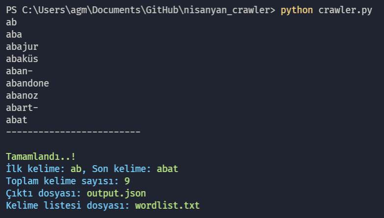

A Python script to crawl the online Turkish etymological dictionary, [nisanyansozluk.com](https://www.nisanyansozluk.com/).

_Disclaimer: For research purposes, this repository does not contain any dataset from the mentioned website._

## How to Use

1. Download and unzip the [master](../../archive/refs/heads/master.zip).
2. Install the dependencies.
    - . `pip install -r requirements.txt`
3. Put your _first_ and _last_ words into the script.
    - If you want to dump whole database skip this(use the defaults). For now _first_ and _last_ words in the dictiorany are _"ab"_ <- -> _"zürriyet"_.
4. Run the script.
    - `python crawler.py`

_Note: Be aware when this code was published. if the site will be updated in the future this code may not work properly._

## Structures of exported files

### output.json

```json
"word1": {
    "baslik": "",
    "tarihce": "",
    "koken": "",
    "daha_fazla": [""],
    "ek_aciklama": "",
    "benzer_sozcukler": [""],
    "maddeye_gonderenler": [""],
    "tarih": ""
},
"word2": {...
```

### wordlist.txt

```
word1
word2
...
```

## License

CC0
